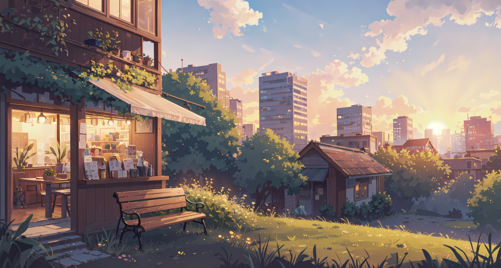

# Clay

Clay is a warm, earthy dark theme for Omarchy built around low-glare backgrounds, soft tan foregrounds, and restrained accents of clay gold, ember orange, olive, and muted violet.

It is designed to pair with the Clay Neovim colorscheme so your editor and desktop feel like one cohesive environment.

---

## Preview



---

## Install

Use the Omarchy theme installer:

```bash
omarchy-theme-install https://github.com/YOUR_GITHUB_USERNAME/clay
```

---

## Included

Clay currently includes theme support for:

- Hyprland
- Hyprlock
- Waybar
- Wofi
- Walker
- Mako
- SwayOSD
- btop
- Warp
- Base16 exports
- Neovim integration for Omarchy

---

## Palette Notes

Clay uses a warm, grounded palette built around:

- deep brown-black backgrounds
- soft tan foregrounds
- clay gold as the primary accent
- ember orange for stronger emphasis
- olive and muted green for support
- violet and plum as secondary accents

The shared palette is centered in:

- `colors.css`
- `colors.toml`

These files act as the cross-application palette bridge for the rest of the theme bundle.

---

## Wallpapers

Place Clay-compatible wallpapers in the `backgrounds/` directory.

Warm, earthy, muted, evening, desert, firelit, rustic, low-glare, and ambient scenes tend to match Clay best.

---

## Notes

- `hyprland.conf` provides Clay border and decoration colors intended to layer cleanly on top of your existing Omarchy setup.
- `hyprlock.conf` provides a matching lockscreen palette.
- `neovim.lua` targets the Clay Neovim theme and applies Omarchy-specific popup and completion highlight overrides.
- This bundle is designed to complement an existing Omarchy configuration rather than fully replace all app configs.

---

## Attribution

- Clay theme design and packaging: Chaz Beaver
- Omarchy theme structure inspiration from the Omarchy theme ecosystem
- Cava theme file may require additional Clay-specific tuning if you want it fully aligned

---

## License

Use, adapt, and modify freely for your personal setup.
